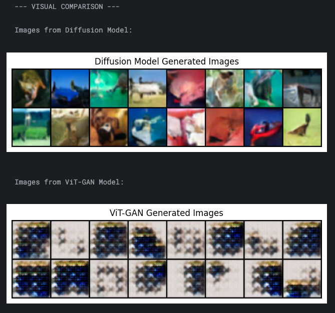
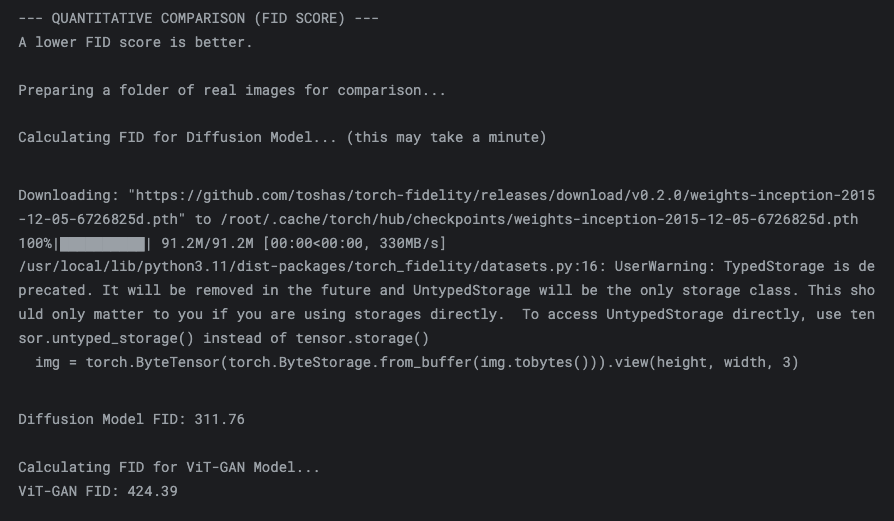

# ViT vs Diffusion: CIFAR-10 Image Generation

**Kaggle Notebook:** [https://www.kaggle.com/code/huseyincavus/vit-vs-diffusion](https://www.kaggle.com/code/huseyincavus/vit-vs-diffusion)

This notebook compares two generative models on the CIFAR-10 dataset:

1. **Diffusion Model (DDPM)**
   - Trains a diffusion model to generate images from noise.
   - Uses the `diffusers` library and visualizes generated samples.

2. **ViT-GAN**
   - Trains a GAN with a Vision Transformer (ViT) as the discriminator.
   - Generates images and visualizes results.

**Comparison**
- Shows side-by-side visual results from both models (see below).
- Computes FID scores for quantitative comparison.

   

*Visual comparison of images generated by Diffusion and ViT-GAN models.*

   

*FID score comparison between models (lower is better).* 

**Usage**
- Run all cells in order. Required libraries are installed automatically.
- Training may take time and requires a GPU for best results.
